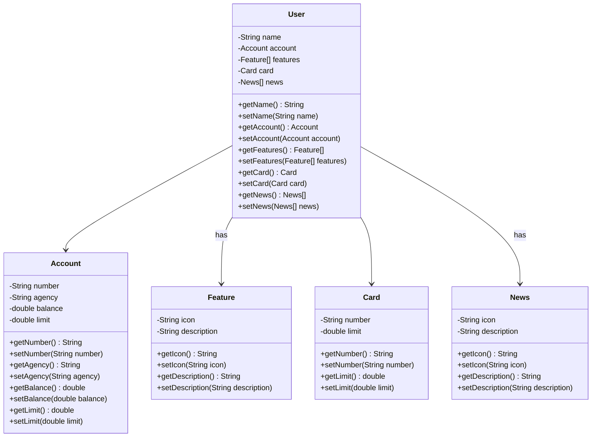

# Decola Tech 2025 Desafio

## Diagrama de Classes

```mermaid
classDiagram
    class User {
        -String name
        -Account account
        -Feature[] features
        -Card card
        -News[] news
        +getName() String
        +setName(String name)
        +getAccount() Account
        +setAccount(Account account)
        +getFeatures() Feature[]
        +setFeatures(Feature[] features)
        +getCard() Card
        +setCard(Card card)
        +getNews() News[]
        +setNews(News[] news)
    }

    class Account {
        -String number
        -String agency
        -double balance
        -double limit
        +getNumber() String
        +setNumber(String number)
        +getAgency() String
        +setAgency(String agency)
        +getBalance() double
        +setBalance(double balance)
        +getLimit() double
        +setLimit(double limit)
    }

    class Feature {
        -String icon
        -String description
        +getIcon() String
        +setIcon(String icon)
        +getDescription() String
        +setDescription(String description)
    }

    class Card {
        -String number
        -double limit
        +getNumber() String
        +setNumber(String number)
        +getLimit() double
        +setLimit(double limit)
    }

    class News {
        -String icon
        -String description
        +getIcon() String
        +setIcon(String icon)
        +getDescription() String
        +setDescription(String description)
    }

    User --> Account
    User --> Feature : has
    User --> Card
    User --> News : has
```

